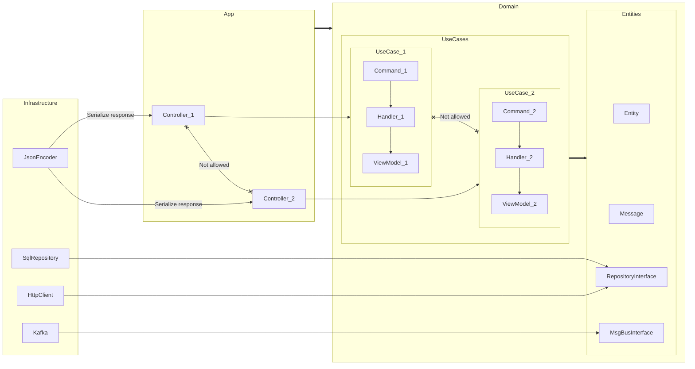

# О чём

Пример парсинга объявлений.

Очередь на KeyDB Stream, база на Manticore. Dependency Injection через Wire.

## Запуск

* `docker compose up -d` (create `compose.override.yaml`)
* `docker exec -i -t vep-app sh`
* `make migrate`

## Routes

* `http://127.0.0.13/` Список
* `http://127.0.0.13/metrics` Метрики

## Тесты

`make test` or `make coverage-html`

## Слои

`./internal/app` -> `./internal/infrastructure` -> `./internal/domain`

* `./internal/app/server(|scheduler|consumer)` Ввод/Вывод
* `./internal/infrastructure` Реализация интерфейсов и вспомогательные компоненты
* `./internal/domain` Доменная область (Entities + UseCases)

